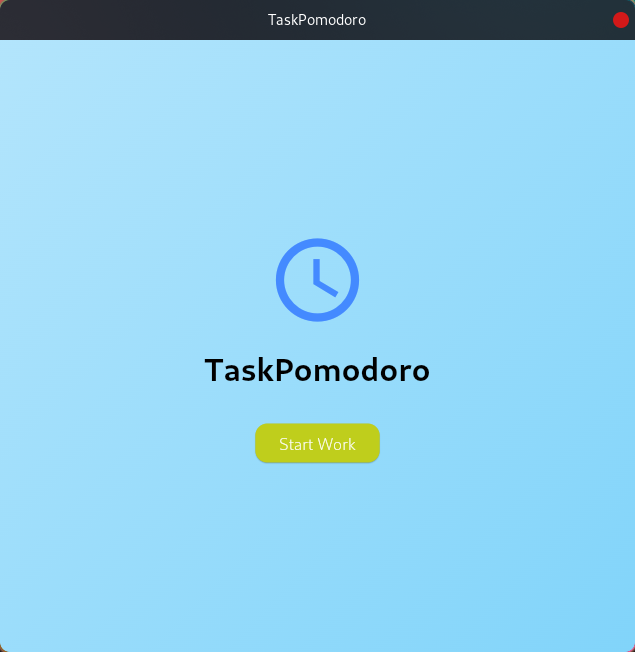
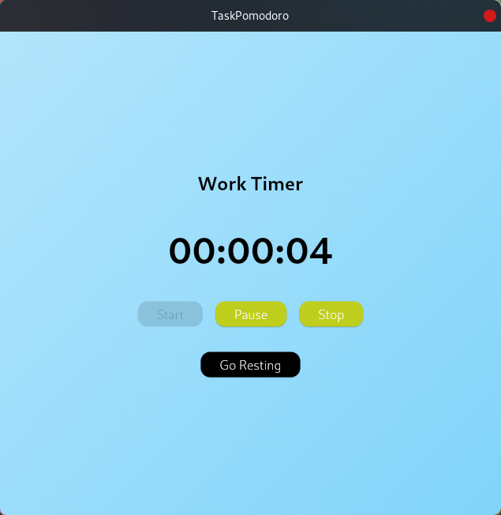
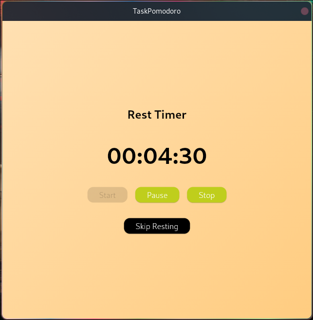

# TaskPomodoro: A Flutter Pomodoro Timer App

## Description

TaskPomodoro is a Flutter-based Pomodoro Timer app that helps you manage your work and rest intervals effectively. The app features customizable work and rest durations, intuitive UI, and seamless navigation between work and rest pages. It is designed to boost productivity by encouraging regular breaks and focused work sessions.

## Features

- **Work Timer**: Start, pause, resume, and stop the work timer.
- **Rest Timer**: Automatically transition to rest periods after work sessions, or manually skip rest periods.
- **Intuitive UI**: Clean and user-friendly interface with gradient backgrounds and easy-to-use buttons.
- **Snackbar Hints**: Provides hints through snackbars for actions like long pressing buttons.

## Screenshots





## Getting Started

### Prerequisites

- [Flutter](https://flutter.dev/docs/get-started/install) should be installed on your machine.
- A code editor like [Visual Studio Code](https://code.visualstudio.com/) or [Android Studio](https://developer.android.com/studio).

### Installation

1. **Clone the repository**:
    ```sh
    git clone https://github.com/andreicosmin02/TaskPomodoro.git
    cd flutter-pomodoro-timer
    ```

2. **Install dependencies**:
    ```sh
    flutter pub get
    ```

3. **Run the app**:
    ```sh
    flutter run
    ```

## Project Structure

- `lib/main.dart`: Main entry point of the application.
- `lib/screens/starting_page.dart`: Starting page with the "TaskPomodoro" text and "Start Work" button.
- `lib/screens/working_page.dart`: Working page with the timer and control buttons.
- `lib/screens/resting_page.dart`: Resting page with the timer and control buttons.
- `lib/utils/duration_utils.dart`: Utility functions for duration calculations.
- `lib/utils/snackbar_utils.dart`: Snackbar display logic.
- `lib/widgets/gradient_background.dart`: Gradient background widget.

## Usage

1. **Starting Page**: Press the "Start Work" button to navigate to the working page.
2. **Working Page**: 
    - Start the timer by pressing the "Start" button.
    - Pause/resume the timer using the "Pause/Resume" button.
    - Stop the timer and return to the starting page by pressing the "Stop" button.
    - Long press the "Go Resting" button to navigate to the resting page.
3. **Resting Page**:
    - Start the rest timer by pressing the "Start" button.
    - Pause/resume the rest timer using the "Pause/Resume" button.
    - Stop the rest timer and return to the starting page by pressing the "Stop" button.
    - Long press the "Skip Resting" button to navigate back to the working page.


## Contact

If you have any questions or feedback, please feel free to reach out to [andreicosmin02](https://github.com/andreicosmin02).
